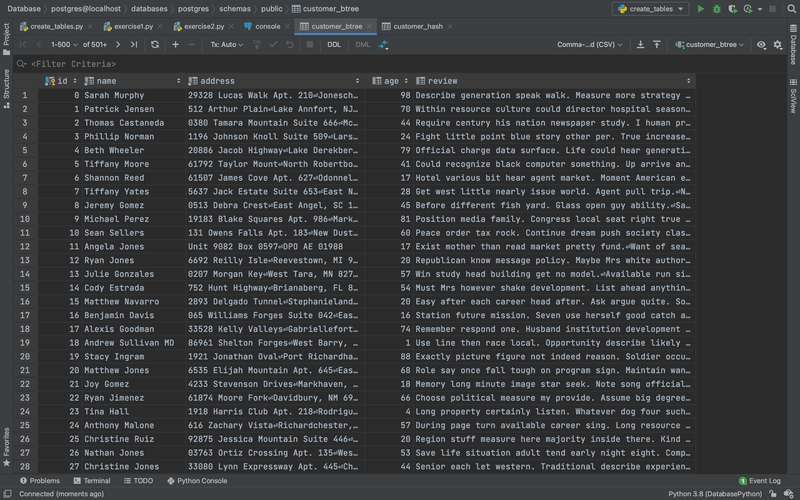
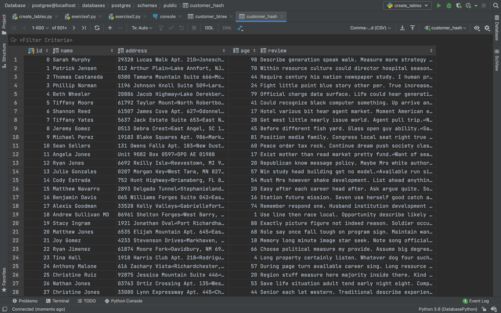
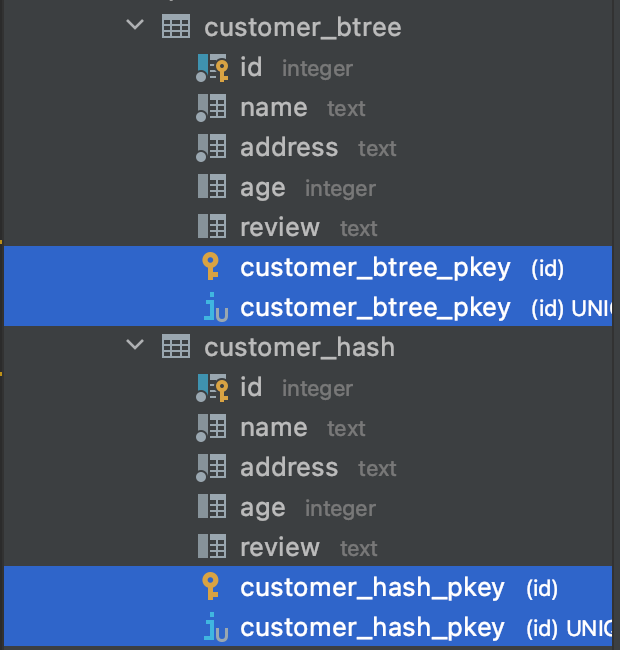
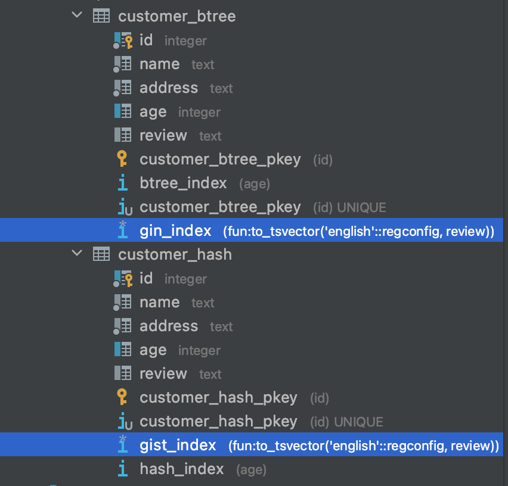

# Steps explanation

## Creating tables

Firstly, in create_tables.py I created two tables CUSTOMER_BTREE and CUSTOMER_HASH.
Then I filled identical data into both tables. amount = 100k.

Here is the result:




## Exercise 1

I ran the python script exercise1.py for analyzing performance with and without indexing.
Indexing was on *age* column
It replicates the following queries:

```PostgreSQL
Explain ANALYZE SELECT * FROM CUSTOMER_BTREE WHERE age > 32 AND age < 36;
CREATE INDEX btree_index ON CUSTOMER_BTREE USING btree (age);
Explain ANALYZE SELECT * FROM CUSTOMER_BTREE WHERE age > 32 AND age < 36;

Explain ANALYZE SELECT * FROM CUSTOMER_HASH WHERE age > 32 AND age < 36;
CREATE INDEX hash_index ON CUSTOMER_HASH USING hash (age);
Explain ANALYZE SELECT * FROM CUSTOMER_HASH WHERE age > 32 AND age < 36;
```

So, we get indexes


Here is the output result from a script:

> Before indexing
[('Seq Scan on customer_btree  (cost=0.00..4592.42 rows=2994 width=215) (actual time=0.013..15.946 rows=2992 loops=1)',), ('  Filter: ((age > 32) AND (age < 36))',), ('  Rows Removed by Filter: 97008',), ('Planning Time: 1.008 ms',), ('Execution Time: 16.166 ms',)]

> After indexing with B-tree
[('Bitmap Heap Scan on customer_btree  (cost=66.97..3292.66 rows=2993 width=215) (actual time=1.173..3.274 rows=2992 loops=1)',), ('  Recheck Cond: ((age > 32) AND (age < 36))',), ('  Heap Blocks: exact=1918',), ('  ->  Bitmap Index Scan on btree_index  (cost=0.00..66.22 rows=2993 width=0) (actual time=0.897..0.897 rows=2992 loops=1)',), ('        Index Cond: ((age > 32) AND (age < 36))',), ('Planning Time: 0.400 ms',), ('Execution Time: 3.498 ms',)]

> After indexing with Hash
[('Seq Scan on customer_hash  (cost=0.00..4592.00 rows=3078 width=215) (actual time=0.008..10.250 rows=2992 loops=1)',), ('  Filter: ((age > 32) AND (age < 36))',), ('  Rows Removed by Filter: 97008',), ('Planning Time: 0.255 ms',), ('Execution Time: 10.369 ms',)]


So, before the indexing there was **cost=0.00..4592.42**.

After indexing using B-tree I got: **cost=0.00..66.22**
and for indexing with Hash: **cost=0.00..4592.00**

Well, B-tree was much more effective than hash.

## Exercise 2

I ran the python script exercise2.py for analyzing performance with and without indexing.
I used the same tables since for this exercise I indexed another column *review*.
It replicates the following queries:

```PostgreSQL
Explain ANALYZE SELECT * FROM CUSTOMER_BTREE WHERE to_tsvector('english', review) @@ to_tsquery('english', 'face | group | movie');
CREATE INDEX gin_index ON CUSTOMER_BTREE USING gin (to_tsvector('english', review));
Explain ANALYZE SELECT * FROM CUSTOMER_BTREE WHERE to_tsvector('english', review) @@ to_tsquery('english', 'face | group | movie');

Explain ANALYZE SELECT * FROM CUSTOMER_HASH WHERE to_tsvector('english', review) @@ to_tsquery('english', 'face | group | movie');
CREATE INDEX gist_index ON CUSTOMER_HASH USING gist (to_tsvector('english', review));
Explain ANALYZE SELECT * FROM CUSTOMER_HASH WHERE to_tsvector('english', review) @@ to_tsquery('english', 'face | group | movie');
```

So, we get indexes



Here is the output result from a script:

> Before indexing
[('Gather  (cost=1000.00..15178.80 rows=1493 width=215) (actual time=3.033..2213.539 rows=6580 loops=1)',), ('  Workers Planned: 2',), ('  Workers Launched: 2',), ('  ->  Parallel Seq Scan on customer_btree  (cost=0.00..14029.50 rows=622 width=215) (actual time=6.798..2199.873 rows=2193 loops=3)',), ("        Filter: (to_tsvector('english'::regconfig, review) @@ '''face'' | ''group'' | ''movi'''::tsquery)",), ('        Rows Removed by Filter: 31140',), ('Planning Time: 1.803 ms',), ('Execution Time: 2214.409 ms',)]

> After indexing with gin
[('Bitmap Heap Scan on customer_btree  (cost=39.57..2992.35 rows=1493 width=215) (actual time=1.411..3.739 rows=6580 loops=1)',), ("  Recheck Cond: (to_tsvector('english'::regconfig, review) @@ '''face'' | ''group'' | ''movi'''::tsquery)",), ('  Heap Blocks: exact=2777',), ('  ->  Bitmap Index Scan on gin_index  (cost=0.00..39.19 rows=1493 width=0) (actual time=1.131..1.131 rows=6580 loops=1)',), ("        Index Cond: (to_tsvector('english'::regconfig, review) @@ '''face'' | ''group'' | ''movi'''::tsquery)",), ('Planning Time: 0.190 ms',), ('Execution Time: 4.019 ms',)]

> After indexing with gist
[('Bitmap Heap Scan on customer_hash  (cost=103.85..3056.64 rows=1493 width=215) (actual time=18.354..295.610 rows=6580 loops=1)',), ("  Recheck Cond: (to_tsvector('english'::regconfig, review) @@ '''face'' | ''group'' | ''movi'''::tsquery)",), ('  Heap Blocks: exact=2777',), ('  ->  Bitmap Index Scan on gist_index  (cost=0.00..103.48 rows=1493 width=0) (actual time=17.329..17.329 rows=6580 loops=1)',), ("        Index Cond: (to_tsvector('english'::regconfig, review) @@ '''face'' | ''group'' | ''movi'''::tsquery)",), ('Planning Time: 0.572 ms',), ('Execution Time: 296.061 ms',)]

So, before the indexing there was **cost=1000.00..15178.80**.

After indexing using gin I got: **cost=0.00..39.19**
and for indexing with gist: **cost=0.00..103.48**

Well, gin was faster than gist. However, both of them were much more effective 
for searching text than without indexing approach.

