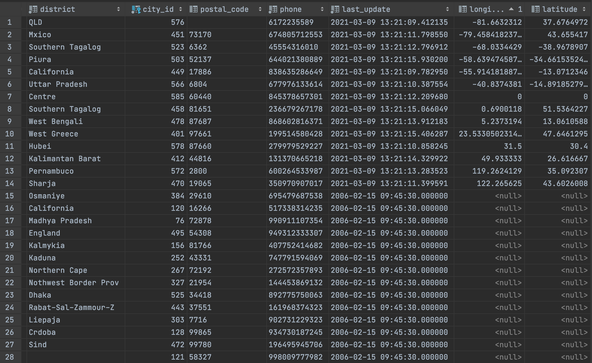

## Report for the Home Assignment - Week 7.

### Exercise 1.

#### Query

Query  wtih function to retrieve addresses that contains “11” and city_id between 400-600:

```PostgreSQL
CREATE OR REPLACE FUNCTION get_addresses()
    RETURNS TABLE
            (
                address_id  integer,
                address     varchar(50)
            )
AS
$$
BEGIN
    RETURN QUERY
        SELECT address.address_id, address.address
        FROM address
        WHERE address.city_id >= 400
          AND address.city_id <= 600
          AND address.address LIKE '%11%';
END;
$$ LANGUAGE plpgsql;

```

#### Python script

Python script which runs this query. Then in *address* table it creates longitude and latitude, and adds information for such addresses which satisfy the query. Any area that geoPy doesn't recognize put columns equal to 0, 0 values. Other addresses which haven't been selected have null, null values. For some machines geopy will work only with imported libraries: *ssl*, *certifi*, *geopy* and with following lines of code:

```Python
ctx = ssl.create_default_context(cafile=certifi.where())
geopy.geocoders.options.default_ssl_context = ctx
```

In case of any trouble, try to uncomment these lines.

Python script:

```Python
import psycopg2
#import ssl
#import certifi
#import geopy
from geopy.geocoders import Nominatim

#ctx = ssl.create_default_context(cafile=certifi.where())
#geopy.geocoders.options.default_ssl_context = ctx

con = psycopg2.connect(database="dvdrental", user="postgres",
                       password="postgres", host="localhost", port="5432")
cur = con.cursor()

sql1 = """
ALTER TABLE address
ADD longitude DOUBLE PRECISION;
"""

sql2 = """
ALTER TABLE address
ADD latitude DOUBLE PRECISION;
"""

cur.callproc('get_addresses', ())
arr = cur.fetchall()

cur.execute(sql1)
con.commit()
cur.execute(sql2)
con.commit()

geolocator = Nominatim(user_agent="ex1")
for line in arr:
    id = line[0]
    add = line[1]
    location = geolocator.geocode(add)
    if location is None:
        lat, long = 0, 0
    else:
        lat, long = location.latitude, location.longitude
    cur.execute(f"""
    UPDATE address SET latitude = {lat}, longitude = {long}
    WHERE address_id = {id};
    """)
    con.commit()
cur.close()
con.close()
```
The database result:



