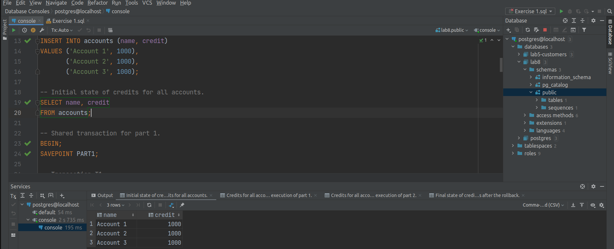
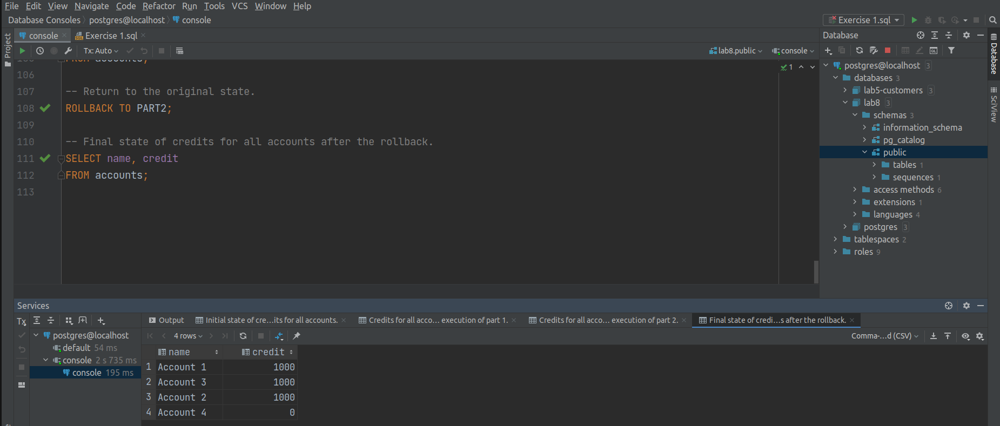

## Report for Lab 8 - Week 10.

### Exercise 1.
The script could be found inside the file [Exercise 1.sql](Exercise%201.sql).
#### Part 1.
Initial state of the table `accounts`: \
 \
State after the transactions T1, T2, T3: \

#### Part 2.
State after the transactions T1, T2, T3: \
 \
Final state of the table `accounts`: \

