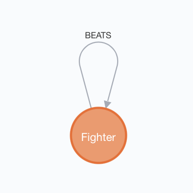
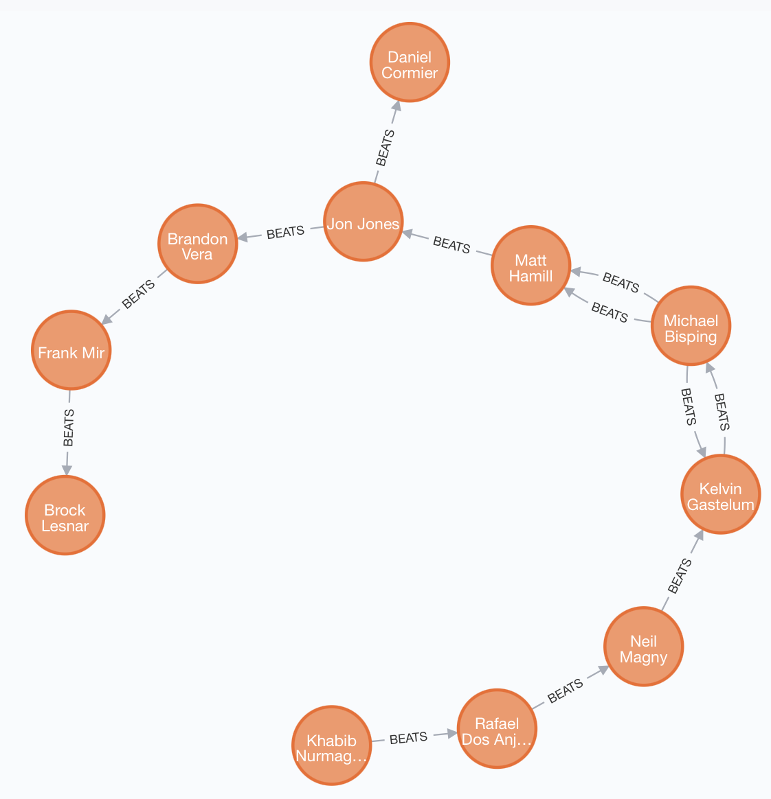
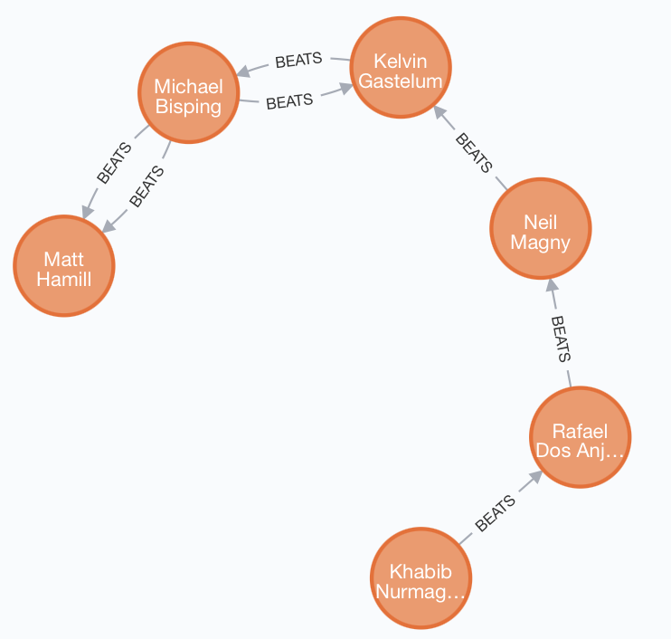

# Week 12

## Exercise 1. Part 1.
```
CREATE (fighter1:Fighter{name:"Khabib Nurmagomedov", weight:155}),
       (fighter2:Fighter{name:"Rafael Dos Anjos", weight:155}),
       (fighter3:Fighter{name:"Neil Magny", weight:170}),
       (fighter4:Fighter{name:"Jon Jones", weight:205}),
       (fighter5:Fighter{name:"Daniel Cormier", weight:205}),
       (fighter6:Fighter{name:"Michael Bisping", weight:185}),
       (fighter7:Fighter{name:"Matt Hamill", weight:185}),
       (fighter8:Fighter{name:"Brandon Vera", weight:205}),
       (fighter9:Fighter{name:"Frank Mir", weight:230}),
       (fighter10:Fighter{name:"Brock Lesnar", weight:230}),
       (fighter11:Fighter{name:"Kelvin Gastelum", weight:185}),
       (fighter1)-[:BEATS]->(fighter2),
       (fighter2)-[:BEATS]->(fighter3),
       (fighter4)-[:BEATS]->(fighter5),
       (fighter6)-[:BEATS]->(fighter7),
       (fighter4)-[:BEATS]->(fighter8),
       (fighter8)-[:BEATS]->(fighter9),
       (fighter9)-[:BEATS]->(fighter10),
       (fighter3)-[:BEATS]->(fighter11),
       (fighter11)-[:BEATS]->(fighter6),
       (fighter6)-[:BEATS]->(fighter7),
       (fighter6)-[:BEATS]->(fighter11),
       (fighter7)-[:BEATS]->(fighter4)
```


## Exercise 1. Part 2.

### Return all middle/Walter/light weight fighters (155,170,185) who at least have one win.
```
MATCH (fighter:Fighter)-[:BEATS]-(another_fighter:Fighter)
WHERE fighter.weight IN [155, 170, 185]
RETURN fighter
```

