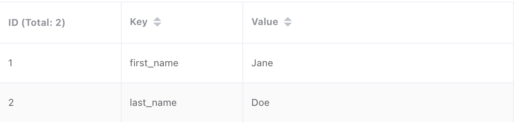
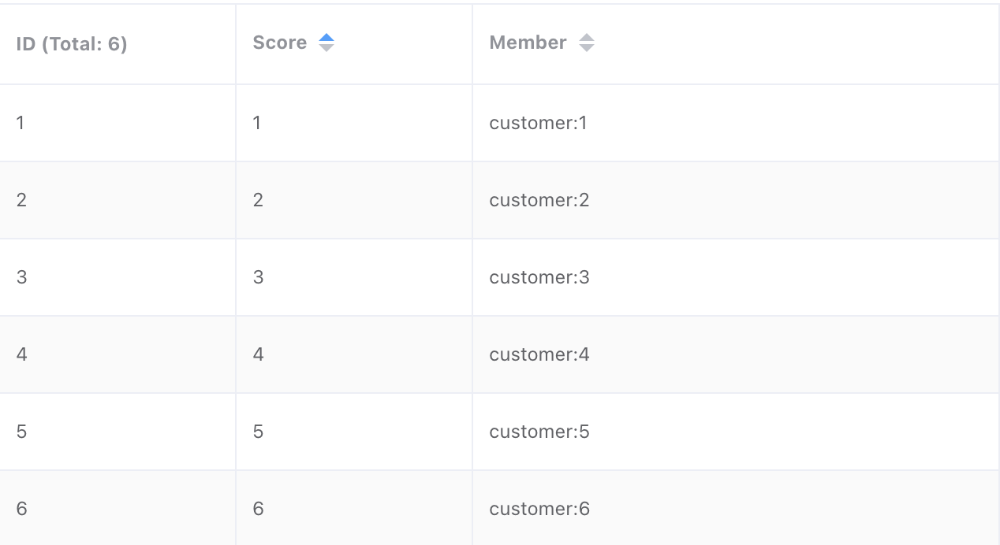
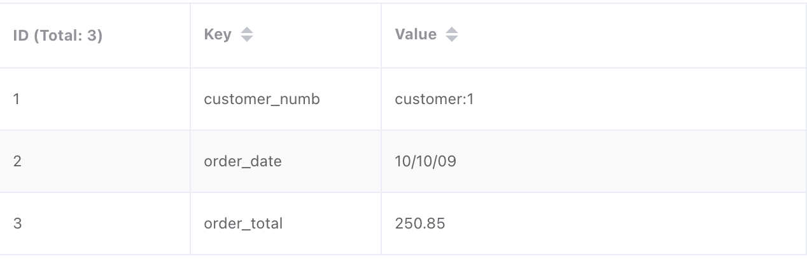
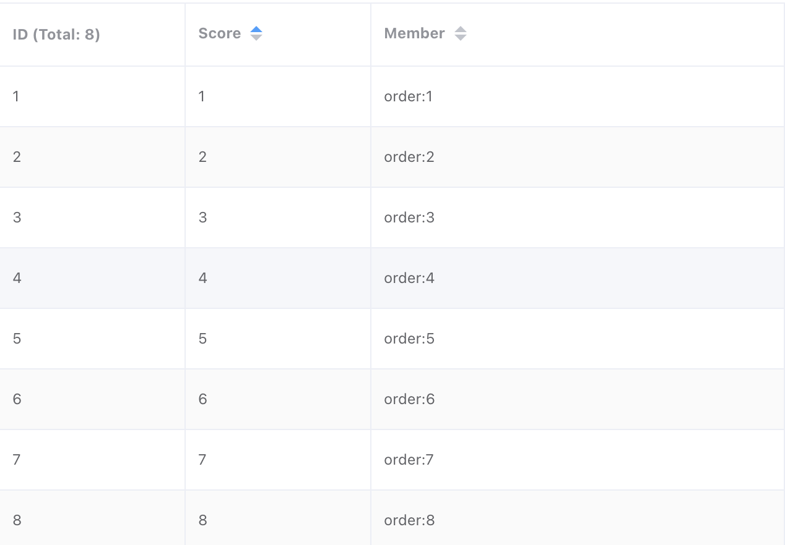
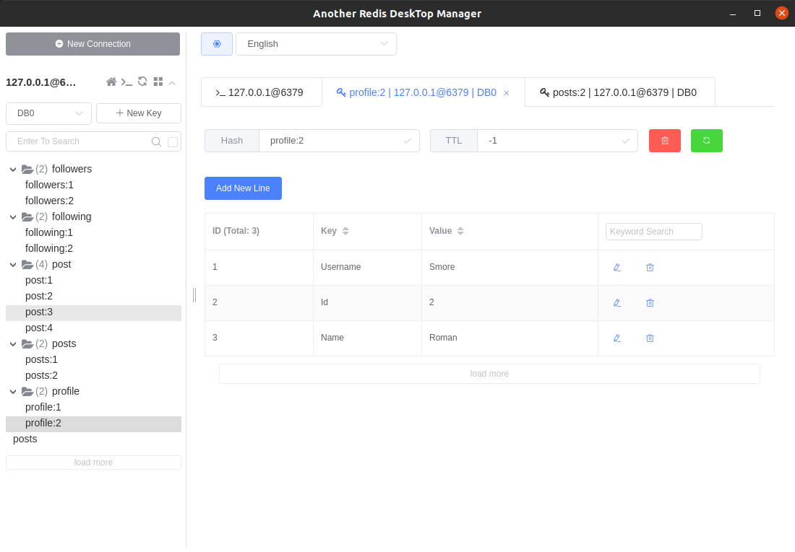
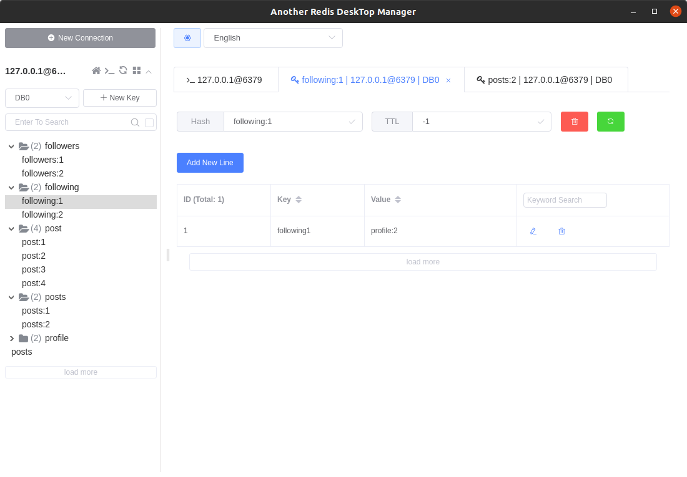
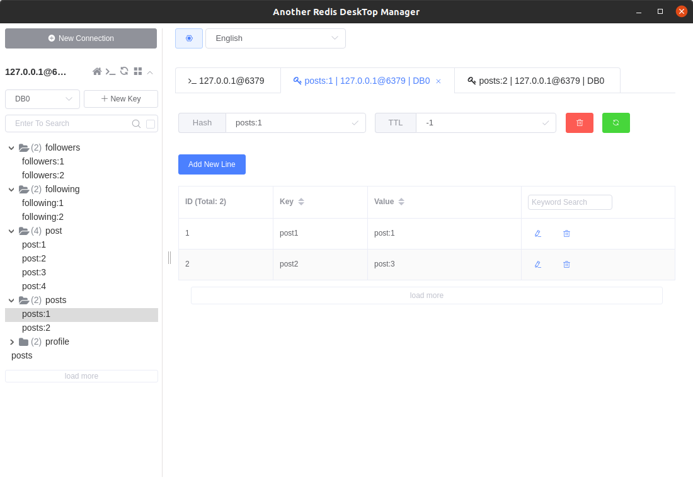
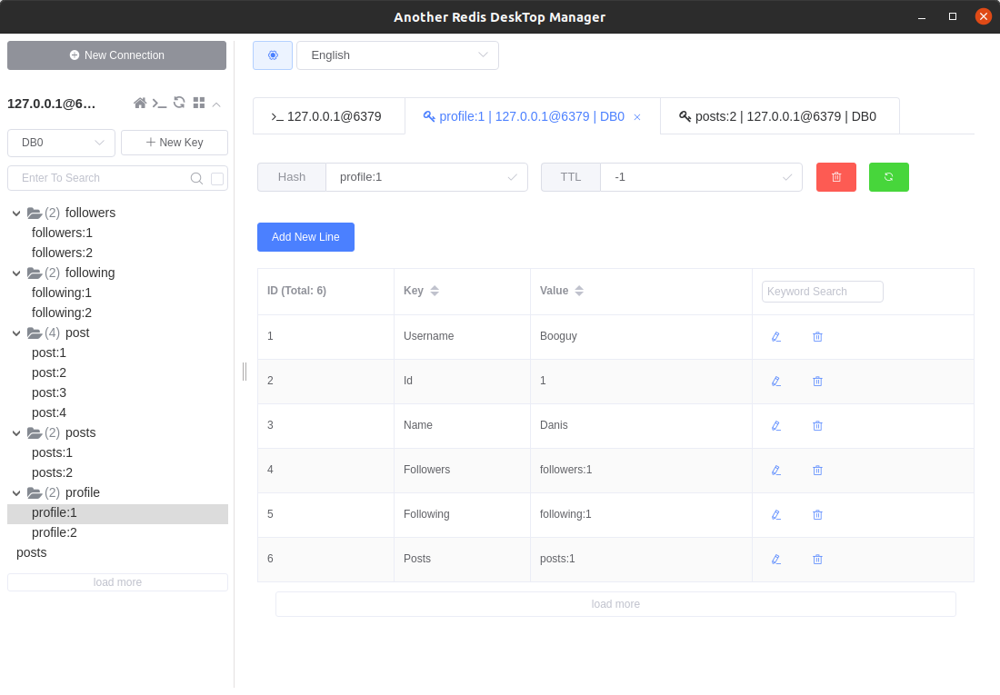

# Week 12

## Exercise 1
Create Customers table
```
HMSET customer:1 first_name "Jane" last_name "Doe"
HMSET customer:2 first_name "John" last_name "Doe"
HMSET customer:3 first_name "Jane" last_name "Smith"
HMSET customer:4 first_name "John" last_name "Smith"
HMSET customer:5 first_name "Jane" last_name "Jones"
HMSET customer:6 first_name "John" last_name "Jones"
ZADD customers 1 customer:1
ZADD customers 2 customer:2
ZADD customers 3 customer:3
ZADD customers 4 customer:4
ZADD customers 5 customer:5
ZADD customers 6 customer:6
```

Create Orders table
```
HMSET order:1 customer_numb customer:1 order_date "10/10/09" order_total 250.85
HMSET order:2 customer_numb customer:2 order_date "2/21/10" order_total 125.89
HMSET order:3 customer_numb customer:3 order_date "11/15/09" order_total 1567.99
HMSET order:4 customer_numb customer:4 order_date "11/22/09" order_total 180.92
HMSET order:5 customer_numb customer:4 order_date "12/15/09" order_total 565.00
HMSET order:6 customer_numb customer:6 order_date "11/22/09" order_total 25.00
HMSET order:7 customer_numb customer:6 order_date "10/8/09" order_total 85.00
HMSET order:8 customer_numb customer:6 order_date "12/29/09" order_total 109.12
ZADD orders 1 order:1
ZADD orders 2 order:2
ZADD orders 3 order:3
ZADD orders 4 order:4
ZADD orders 5 order:5
ZADD orders 6 order:6
ZADD orders 7 order:7
ZADD orders 8 order:8
```

The entry of the Customers table:


The Customers table:


The entry of the Orders table:


The Orders table:



## Exercise 2
Set `Username`, `Id` and `Name` for users:
```
HSET profile:1 Username "Booguy" Id 1 Name "Danis"
HSET profile:2 Username "Smore" Id 2 Name "Roman"
```


Assign followers for each profile:
```
HSET followers:1 follower1 profile:2
HSET followers:2 follower1 profile:1
```


Assign following users for each profile:
```
HSET following:1 following1 profile:2
HSET following:2 following1 profile:1
```


Create posts: 
```
HMSET post:1 user profile:1 time 2021-04-20-13:02:10 text "hello"
HMSET post:2 user profile:2 time 2021-04-20-13:02:15 text "hi"
HMSET post:3 user profile:1 time 2021-04-20-13:02:20 text "how are you"
HMSET post:4 user profile:2 time 2021-04-20-13:02:25 text "fine"
```


Assign posts to the users:
```
HSET posts:1 post1 post:1 post2 post:3
HSET posts:2 post1 post:2 post2 post:4
```


Add `Followers`, `Following` and `Posts` fields:
```
HSET profile:1 Followers followers:1 Following following:1 Posts posts:1
HSET profile:2 Followers followers:2 Following following:2 Posts posts:2
```

